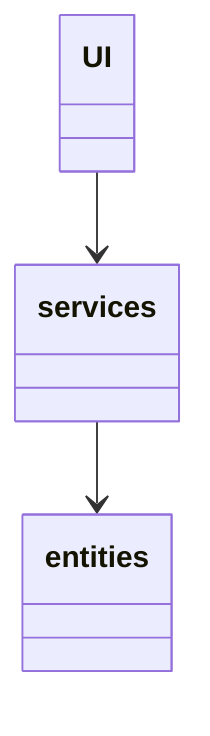
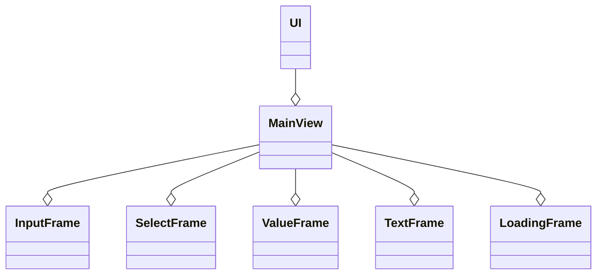
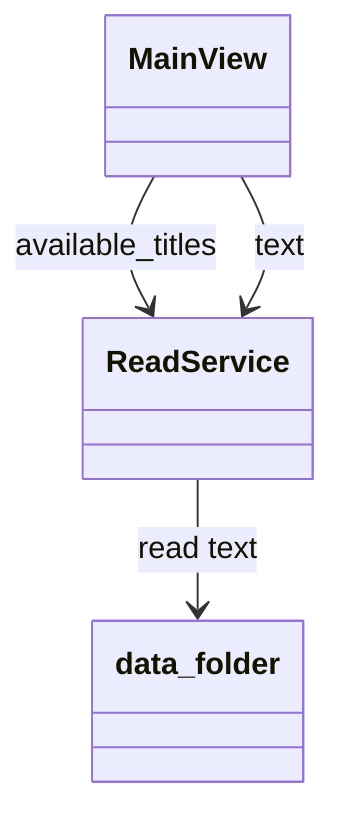
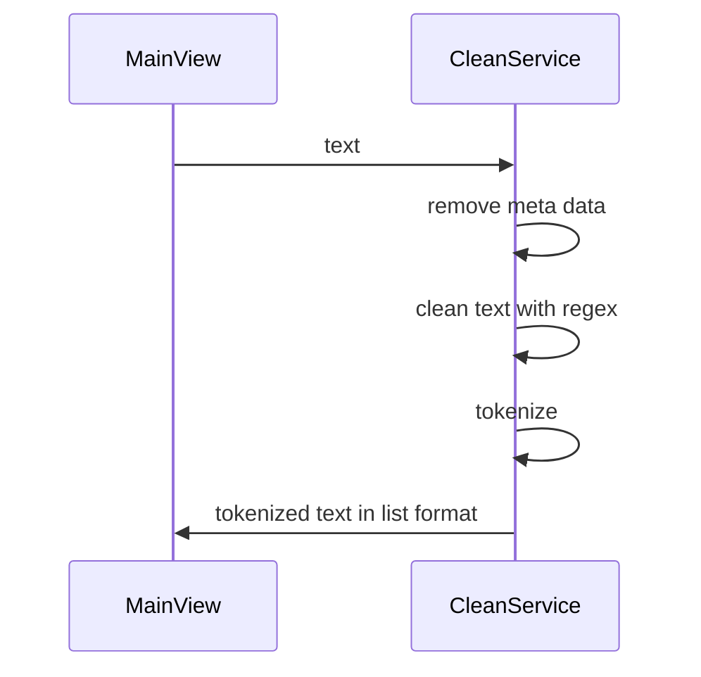
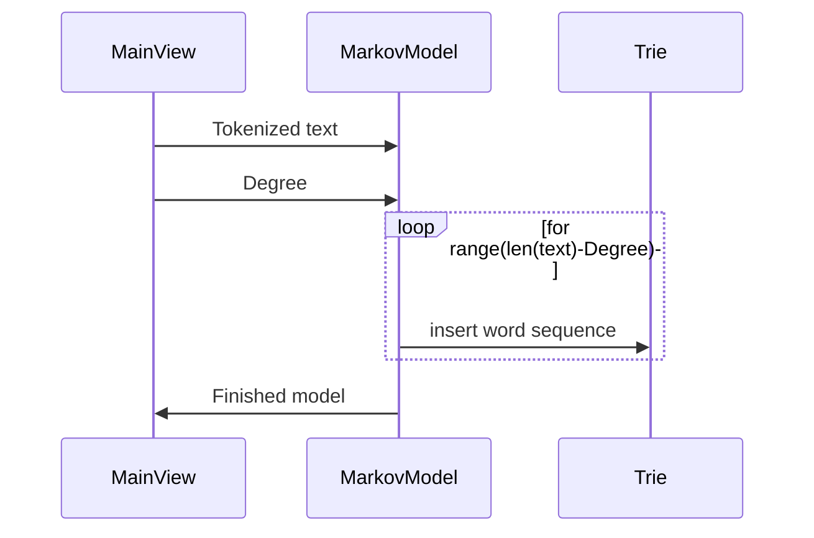
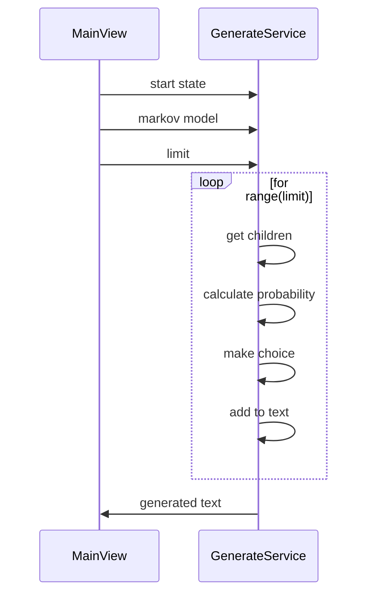
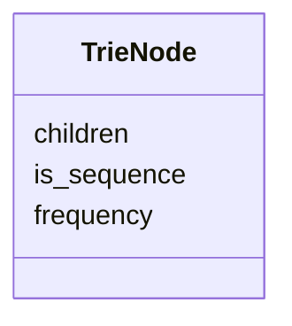
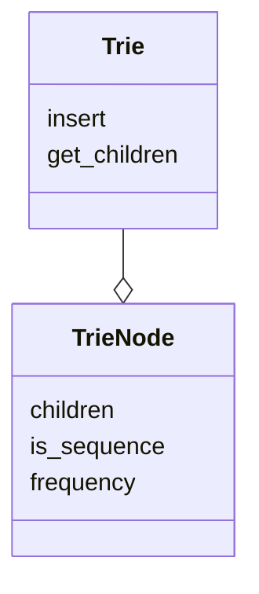
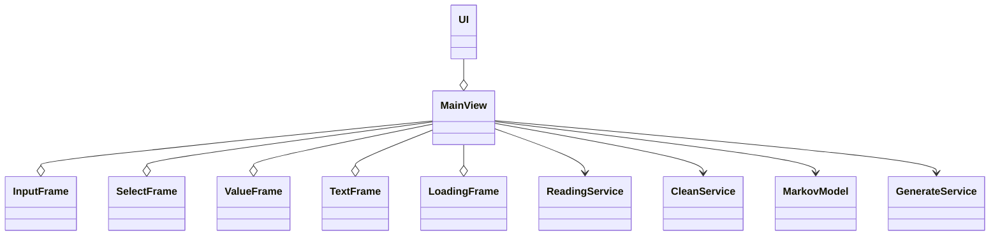
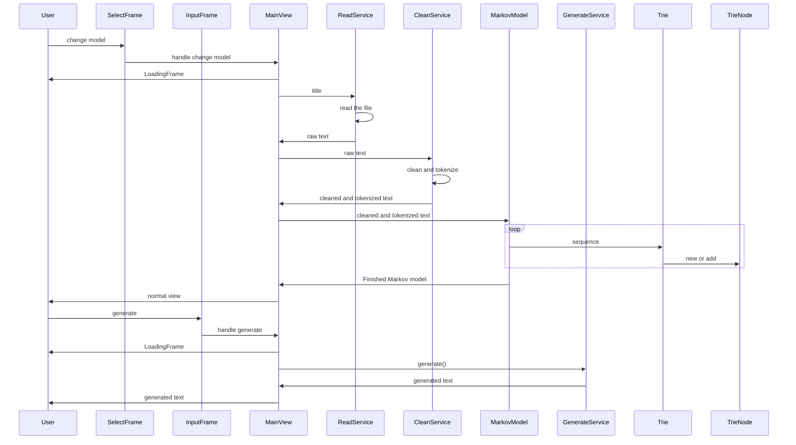

# Architecture Description

---

### Table of Contents
- [Basic Structure](#basic-structure)
- [User Interface](#user-interface)
- [Services](#services)
    - [ReadService](#readservice)
    - [CleanService](#cleanservice)
    - [MarkovModel](#markovmodel)
    - [GenerateService](#generateservice)
- [Entities](#entities)
    - [TrieNode](#trienode)
    - [Trie](#trie)
- [Structure as a Whole](#structure-as-a-whole)
- [Main Functionality](#main-functionality)
- [Big O Analysis](#big-o-analysis)

---

## Basic Structure

The app's general structure follows a three-layered model.

The UI component includes everything related to user interface elements. This part only displays data retrieved from service elements. The service elements implement the app logic, this includes the retrieval of base data, cleaning, generating the Markov Model, and generating the text. The task of entities is to represent the Markov Chain in Trie data structure format.

[Back to Top](#architecture-description)

---

## User Interface

The user interface consists of view(s) and frames. View(s), managed by the UI element, are built from a collection of Frames.

In total, the app includes a view that manages the frames. The frames exclusively view data to the user and pass inputs to MainView. Given user input, the Frame in question passes that information to the MainView, where data is processed using Service components. The main view utilizes threading to show a loading frame while the action occurs in service components.

[Back to Top](#architecture-description)

---

## Services

---

### ReadService

The ReadService retrieves book data by title from the data folder and provides all the available sources to UI.

[Back to Top](#architecture-description)

---

### CleanService

The CleanService is responsible for removing excess characters and symbols and tokenizing the cleaned text for future processing. For the cleaning process, it mainly uses techniques from regex, and for tokenization, it uses the simple split() method.

[Back to Top](#architecture-description)

---

### MarkovModel

The Markov model components' responsibilities include the creation of the Markov chain based on the tokenized source text and the user-defined degree. After creating the instance of the Trie entity, the program loops through the tokenized source text and inserts the sequences of words into the Trie data structure according to the degree.

[Back to Top](#architecture-description)

---

### GenerateService

The Generate service works with the Markov model to generate text. It takes the created model, gets a starting sequence, and from then on, obtains the current sequences children to calculate probability in between them. The service then chooses the next word from the children with the weighted average of their chance.

[Back to Top](#architecture-description)

---

## Entities

---

### TrieNode

Represents a node in a Trie data structure

[Back to Top](#architecture-description)

---

### Trie

The Trie entity represents the core data structure. It provides a great way to store the Markov chain in the O(n) time-complexity model. The way it works is similar to any other k-search tree. We should start by demonstrating a trie data structure with a third-degree Markov chain. Let us explore the sentence, "I walked my dog the other day and saw a beautiful fountain." The program needs to save every 4-word sequence into the Trie data structure to build a third-degree chain which means that sequences; "I walked my dog," "walked my dog the," "my dog the other," "dog the other day," "the other day and," "other day and saw," "day and saw a," "and saw a beautiful," "saw a beautiful fountain." are inserted into the Trie data structure(note that this is not the best example out there).

[Back to Top](#architecture-description)

---

## Structure as a Whole

[Back to Top](#architecture-description)

---

## Main Functionality

The user changes the source title and generates text (simplified version)

[Back to Top](#architecture-description)

---

## Big O Analysis

The program achieved the exact time- and space complexity noted in the [requirements specification](./requirements_specification.md). For performance testing, please refer to the testing document[testing document](./testing.md).