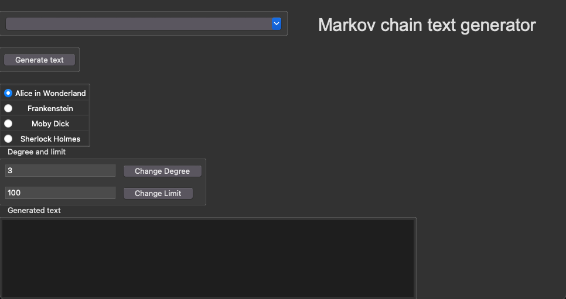

# Instructions

---

### Getting Started

1. Download the [latest release](https://github.com/matiasto/text_generator/releases/tag/loppupalautus)

2. Navigate to the project root folder and install dependencies by running:
```bash
poetry install
````

3. To start the app, run the following command:
```bash
poetry run invoke start
```

4. Once started, the following view will appear:



---

### Usage

