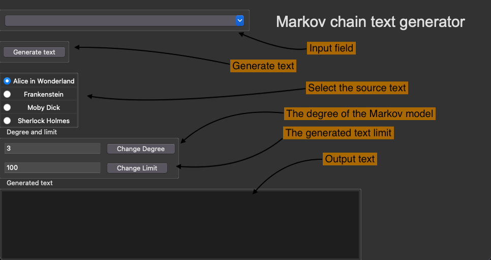
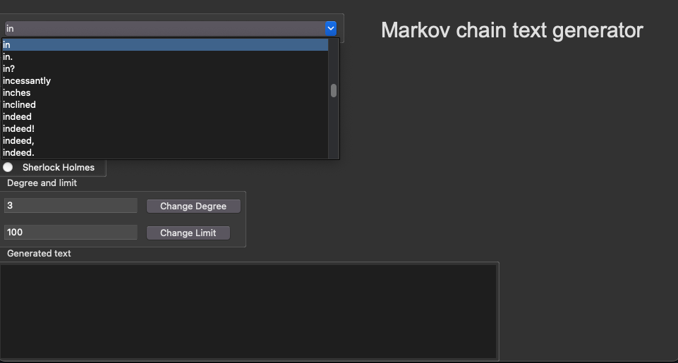
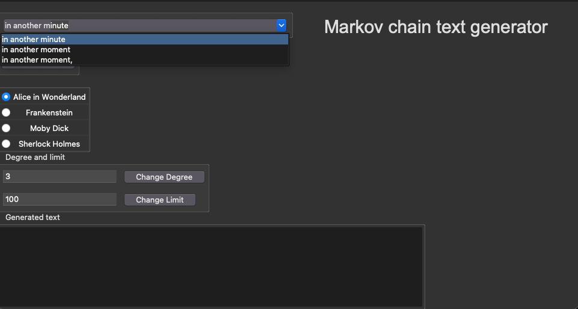
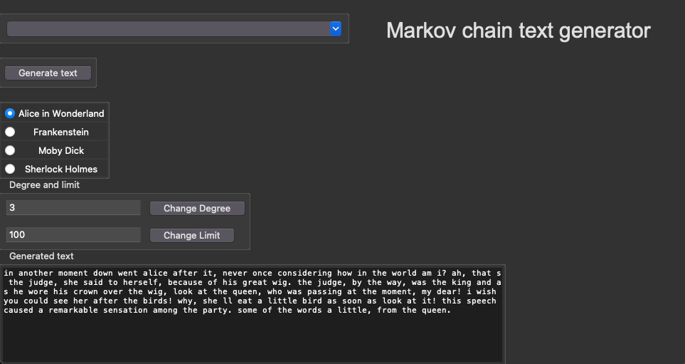
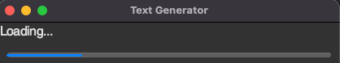

# Instructions

---

### Getting Started

1. Download the [latest release](https://github.com/matiasto/text_generator/releases/tag/loppupalautus)

2. Navigate to the project root folder and install dependencies by running:
```bash
poetry install
````

3. To start the app, run the following command:
```bash
poetry run invoke start
```

4. Once started, the following view will appear:


---

# Usage



### Fields explained
- Input field: Set your own beginning sentence with the help of autocomplete.
    - When left empty the program will generate random sequence from the model.
    - Currently restricted to words and sequences that are found in the model.
    - Character limit set to 100.
- Generate text: Press to generate text on the given parameters.
- Select source text: Select the source material for the madol.
    - When chosen, the model will instantly change.
    - It might take a while for some title/degree combinations.
- The Degree of the Markov Model: Change the degree, or in other words, the number of preceding characters taken in to account when calculating the next words probability.
    - Choose anywhere between 1 - 100.
    - Note: As you can imagine, 100 is a bit overkill.
- The generated text limit: Change how many 'words' are generated.
    - Choose anywhere between 1 - 100
- Output text: View the generated text.

# Example

Start writing a word



The program will suggest a complete on the input, and by pressing the down arrow on your keyboard (or by pressing the blue icon), you are presented with different choices conforming to the active model. The suggestions depend on the chosen text and the degree. With a higher degree, the selection becomes ever more limited. You must follow the autocomplete's outline since the program will build upon the input. The program will create a random starting sequence if no match is found on the input.



Once happy with the input, you generate the text with the generate text button. In the case of an empty input field, the program will generate random text based on the parameters and the model.



---

Changing the parameters degree and limit work by inputting the desired value to their respective fields. On degree change, a model retraining will take place; depending on the values, a loading will appear for the duration. Note that pressing the 'change' button is required for the change to take effect.



Happy using!