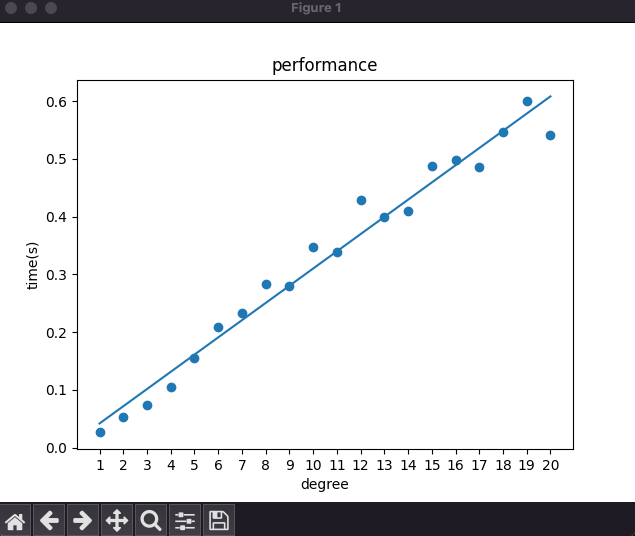
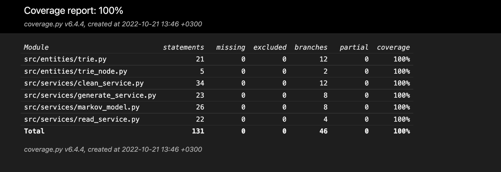

# Testing

The app includes comprehensive automated unit- and integration testing. In addition, the testing incorporated various manual tests to ensure a seamless user experience. As per the core of the course, the program possesses complementary performance tests on creating varying degrees of Markov chains.

## Related Commands
### Tests
```bash
    poetry run invoke test
```

### Performance
```bash
    poetry run invoke performance
```

### Coverage
```bash
    poetry run invoke coverage-report
```

## Unit- And Integration Tests

### App logic
The services test folder holds the components responsible for the core app logic. In the application, the MainView retains control over the service components. The services test folder contains eclectic tests for the services. The tests follow a similar format where the initialization comprises dependency injection to simulate real situations and tests to ensure immaculate function.

### Entities
The entities test folder holds the components responsible for representing the app's core structure, the Trie data structure. The test on the data structure consists of insertions of natural data sources. In practice, the sources are the same sources the actual program uses at runtime.

## Performance
The performance test evaluates the speed of creating a new model with a new degree. On command, the performance test creates new models with a degree range of 1 - 20. Once complete, the script displays a graph of the results. The y-axis represents the time it took to create the model, and the x-axis represents the degree of that model. The text used does not vary between tests.



## Test Coverage
Excluding the user interface, the test coverage is 100%



## System Testing
The system-level tests incorporated exclusively manually performed tests.

## Installation and Configuration
Following the instructions, the app was retrieved and tested successfully in macOS and Linux environments.

## Functionality
All the functions defined in the requirements specification work as intended. The test inputs included invalid and empty values.